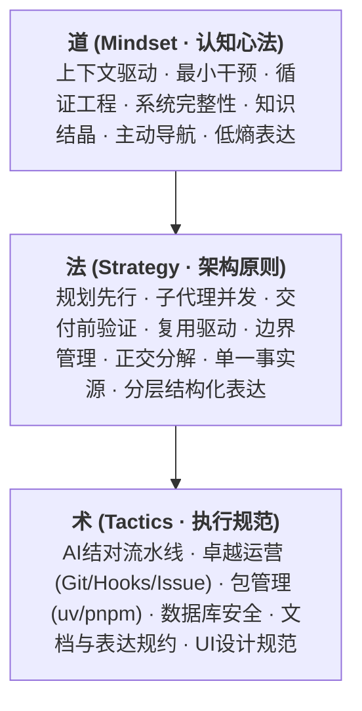

# AGENTS.md

> **AI Agent 软件工程与高保真协作规约 (Single Source of Truth)**

本仓库旨在沉淀和演进规范 AI Agent（Claude Code、Codex、Antigravity 等）在工程项目中的行为准则与人机结对规范。以 **Entropy Reduction (熵减)** 为核心哲学，通过认知心法、架构战略与标准化执行流水线，对抗软件系统的无序熵增。

---

## 🏛 规范架构体系 (道 · 法 · 术)



- **道 (Mindset)**：确立系统的第一性原理，将“熵减”作为底线，警惕因表达与决策混乱带来的巨大商业与协作损失。
- **法 (Strategy)**：提供架构级思考定式，主张“Plan-First Default”与“Verification Before Done”，提倡多模型复合嵌套与算力换空间。
- **术 (Tactics)**：固化可落地的标准化 SOP，包含严格的包管理工具链（统一 `uv` 与 `pnpm`）、Git / Issue 纪律及图文并茂的可视化规范。

---

## 📂 仓库结构与细分规范

本仓库采用“核心总纲 + 垂直细分规约”的解耦架构：

| 文件 / 目录                                                                          | 规范定位           | 核心内容说明                                                             |
| :----------------------------------------------------------------------------------- | :----------------- | :----------------------------------------------------------------------- |
| [AGENTS.md](./AGENTS.md)                                                             | **全局总纲**       | 协作协议核心定义源，统领“道、法、术”全局行为边界。                       |
| [docs/structured-expression-framework.md](./docs/structured-expression-framework.md) | **表达逻辑模型**   | 融合 PREP、金字塔原理、SCQA、STAR 四大模型，定义多层级复合嵌套表达体系。 |
| [docs/browser-validation.md](./docs/browser-validation.md)                           | **浏览器验证协议** | Agent 浏览器自动化与真实用户登录态安全协议，明确 OAuth / 沙箱红线。      |
| [docs/reference-specifications.md](./docs/reference-specifications.md)               | **学术引用规范**   | 核心决策追溯所必须遵循的 IEEE 标准引用格式。                             |
| [sync.sh](./sync.sh)                                                                 | **全局同步脚本**   | 一键将本仓库规约与细分文档应用/分发至本机全局环境。                      |

---

## 🚀 本机全局一键应用

为了使本地 AI Agent 工具（Codex、Claude Code 等）在任何工程目录下均能自动加载本套规约，可通过根目录脚本快速应用：

```bash
# 1. 直接复制模式（静态快照）
./sync.sh

# 2. 符号链接模式（推荐：本仓库变更后，全局实时联动生效）
./sync.sh --link
```

### 映射路径说明

- `AGENTS.md` $\rightarrow$ `~/.codex/AGENTS.md`（Codex 全局系统规则）
- `docs/*.md` $\rightarrow$ `~/.agents/docs/*.md`（跨项目共享的细分规范与事实源）

---

## 🤝 适用智能体生态

- **Claude Code**：支持自定义 Slash Command（如 `/commit`）与全局上下文锚定。
- **Codex**：读取 `~/.codex/AGENTS.md` 实现全生命周期编码约束。
- **Antigravity / Gemini CLI**：严格遵循规划先行、子代理编排与交付自证定式。
